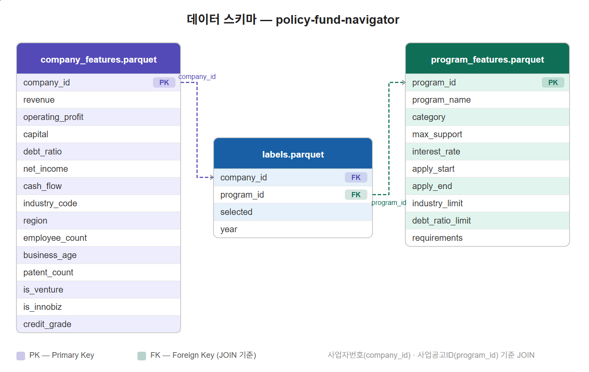

# PRD — 중진공 AI 중기(中企) 자금 네비게이터
**policy-fund-navigator**
버전: 0.3 (초안)
작성일: 2026-04-25
작성자: 지동진
상태: 검토 중

---

## 1. 서비스 개요

### 1.1 배경 및 목적

중소기업이 정책자금을 신청하려면 수십 개의 사업 공고를 직접 확인하고 자격 요건을 대조해야 한다. 이 과정에서 정보 비대칭으로 인해 자격이 되는 기업도 신청을 포기하거나 부적격 사업에 헛걸음하는 문제가 발생한다. 본 서비스는 기업의 재무·기술·인증 데이터를 자동 분석하여 적합한 정책자금을 AI가 매칭하고, 수혜 확률과 개선 가이드를 제공하는 컨설팅 솔루션이다.

### 1.2 서비스 목표

- 사업자번호 입력만으로 신청 가능한 정책자금 Top-N 자동 추천
- 과거 수혜 데이터 기반 수혜 확률(%) 제공
- XAI(설명 가능한 AI) 기반 매칭 이유 및 개선 가이드 제시

### 1.3 타겟 사용자

중소기업진흥공단 실무자

### 1.4 대회 정보

- 대회명: AI, 공공데이터 활용 및 창업 경진대회 공모전
- 평가 기준: [확인 필요 — 세부 평가 지표 기입]
- 제출 형태: [확인 필요 — 서비스 소개서/개발 기술서/시연 영상 등]

---

## 2. 핵심 기능 정의

### 2.1 기업 프로필 자동완성

- 사업자번호 입력 시 OpenDART, KIPRIS API를 통해 기업 정보 자동 조회
- 조회 항목: 재무제표(매출액·영업이익·자본금·부채비율·당기순이익·현금흐름), 업종코드(KSIC), 설립일, 종업원수, 소재지, 특허 보유 현황

### 2.2 정책자금 매칭 (Top-N 추천)

- Hard Filter: 업종·부채비율·업력·소재지 자격 조건 자동 체크
- Soft Filter: 특허·기술력과 사업 공고문 간 의미적 유사도 매칭
- LightGBM LambdaRank 기반 수혜 확률 순위 산출
- 결과: 적격 사업 목록 + 잠정 적격 사업 목록 분리 출력

### 2.3 XAI 기반 컨설팅 리포트

> **XAI(Explainable AI)**: AI 모델이 왜 이런 결과를 냈는지 사람이 이해할 수 있는
> 언어로 설명하는 기술. 본 서비스에서는 SHAP 기법으로 각 feature의 점수 기여도를
> 추출하고 자연어 개선 가이드를 생성한다.

- 매칭 이유 설명: feature별 기여도(SHAP) 기반 자연어 설명
- 개선 가이드: delta 분석 기반 "X만 보완하면 가능" 피드백
- 수혜 확률 변화 시뮬레이션: 지표 개선 시 확률 변화 제시

### 2.4 사후 관리

> **[확인 필요]** 아래 기능의 구현 여부를 결정해주세요.
> - 관심 사업 저장 및 마감 알림 기능
> - 보완 지표 업데이트 시 수혜 확률 실시간 변화 알림

---

## 3. 데이터 정의

### 3.1 데이터 소스

| 구분 | 소스 | 수집 방법 | 상태 |
|---|---|---|---|
| 기업 재무·기본정보 | OpenDART | API | 키 발급 완료 |
| 특허·실용신안 | KIPRIS | API | 승인 대기 중 |
| 사업 공고 목록 | 기업마당(bizinfo) | API | 키 발급 완료 |
| 공고문 원본 | 중진공 홈페이지 | 크롤러 | 구현 예정 |
| 과거 수혜 이력 | 정보공개포털 | CSV | 청구 완료 |
| 신용등급·인증 | KODATA | 샘플 데이터 | 커버리지 제한 |

### 3.2 데이터 스키마


데이터 스키마 다이어그램 (company_features / program_features / labels JOIN 구조)

#### 기업 feature (company_features.parquet)

| 필드 | 설명 |
|---|---|
| company_id | 사업자등록번호 (PK) |
| revenue | 매출액 |
| operating_profit | 영업이익 |
| capital | 자본금 |
| debt_ratio | 부채비율 |
| net_income | 당기순이익 |
| cash_flow | 영업활동 현금흐름 |
| industry_code | 업종코드 (KSIC) |
| region | 소재지 |
| employee_count | 종업원수 |
| business_age | 업력 (설립일 기준) |
| patent_count | 특허 보유 수 |
| is_venture | 벤처기업 인증 여부 |
| is_innobiz | 이노비즈 인증 여부 |
| credit_grade | 신용등급 (없으면 None) |

#### 사업 feature (program_features.parquet)

| 필드 | 설명 |
|---|---|
| program_id | 사업공고 ID (PK) |
| program_name | 사업명 |
| category | 자금/수출/인력/기타 |
| max_support | 지원 한도 |
| interest_rate | 금리 |
| apply_start | 신청 시작일 |
| apply_end | 신청 종료일 |
| industry_limit | 지원 제외 업종 (LLM 파서) |
| debt_ratio_limit | 부채비율 상한 (LLM 파서) |
| requirements | 기타 자격요건 (LLM 파서) |

#### 레이블 (labels.parquet)

| 필드 | 설명 |
|---|---|
| company_id | 사업자등록번호 (FK → company_features) |
| program_id | 사업공고 ID (FK → program_features) |
| selected | 선정여부 (1: 선정, 0: 미선정) |
| year | 수혜 연도 |

### 3.3 수혜 이력 데이터

> **[확인 필요]** 정보공개포털에서 수신한 수혜 이력 CSV의 실제 컬럼 구조를 기입해주세요.
> - 사업자번호 컬럼 존재 여부
> - 선정/미선정 구분 컬럼 존재 여부
> - 커버 연도 범위
> - 총 레코드 수 (대략적으로)

---

## 4. 데이터 파이프라인 아키텍처

### 4.1 전체 흐름


데이터 파이프라인 전체 흐름도

- 기업 데이터 소스 (OpenDART·KIPRIS·KODATA·공공데이터포털) → API 수집기 → 기업 feature
- 공고문 소스 (기업마당·중진공 홈페이지) → 크롤러 + LLM 파서 → 사업 feature + 자격요건 DB
- 수혜 이력 (정보공개포털) → welfare_loader → labels.parquet
- 전체 → S3 processed/ Master DataFrame → 학습 데이터셋 · 자격요건 DB · 임베딩 저장소

### 4.2 Airflow DAG 구조

- extract_dart · extract_kipris · extract_bizinfo (병렬) → transform_merge → load_to_s3 → welfare_loader
- 스케줄: @weekly
- 환경: Apache Airflow 2.9 + Docker Compose
- 스토리지: AWS S3

---

## 5. AI 아키텍처

### 5.1 AI 파이프라인 전체 흐름


LangGraph MAS 에이전트 아키텍처

- 오케스트레이터 → 임베딩 에이전트 → 스코어링 에이전트 → SHAP 에이전트 → 오케스트레이터 (복귀)
- 후보 없을 경우 임베딩 에이전트에서 오케스트레이터로 조기 복귀 (조건부 엣지)
- 오케스트레이터가 피드백 생성 및 최종 응답 조합 후 FastAPI로 전달

### 5.2 스코어링 수식

```
P(Selection) = α·F + β·T + γ·G
```

- F: 재무 점수 (부채비율, 매출성장률, 현금흐름 등)
- T: 기술 점수 (특허수, 출원일, IPC 코드 등)
- G: 정책 가점 (벤처인증, 이노비즈, 고용창출 등)
- α, β, γ: LightGBM LambdaRank 학습 과정에서 NDCG 최적화를 통해 자동 결정

> **NDCG(Normalized Discounted Cumulative Gain)**: 랭킹 모델 성능 평가 지표.
> 실제 선정된 사업이 추천 상위권에 올수록 점수가 높아짐 (1에 가까울수록 우수).
> NDCG@5는 상위 5개, NDCG@10은 상위 10개 기준으로 평가.

### 5.3 XAI 기준

- SHAP TreeExplainer 적용
- feature 기여도 상위 3개 항목 선별
- delta 10% 이내 항목에만 "보완 가능" 피드백 생성
- 음수 기여(감점) 항목 우선 선별

### 5.4 에이전트별 역할 및 Tools

#### 오케스트레이터
- system_prompt: 역할·흐름 제어·피드백 생성 규칙 정의
- planning (ReAct): delta 크기·feature 기여도 기반 피드백 우선순위 결정
- Skills: State 초기화, 흐름 판단, 피드백 템플릿 선택, Gemini API 호출, 최종 응답 조합

#### 임베딩 에이전트
- system_prompt: 역할·필터링 규칙 정의
- Skills: S3 데이터 로드, 하이브리드 임베딩 생성, Hard Filter 실행, Soft Filter 실행, State 업데이트

#### 스코어링 에이전트
- system_prompt: 역할·스코어링 수식·MLflow 로드 방식 정의
- Skills (ML을 Tool로 정의): feature 엔지니어링 Tool, MLflow 모델 로드 Tool, LambdaRank 추론 Tool, Top-N 정렬 Tool, State 업데이트

#### SHAP 에이전트
- system_prompt: 역할·delta 기준·feature 선별 규칙 정의
- Skills: SHAP TreeExplainer 실행 Tool, feature 기여도 추출 Tool, 임계치 delta 계산 Tool, 보완 가능 플래그 설정 Tool, State 업데이트

---

## 6. 기술 스택

| 레이어 | 기술 |
|---|---|
| ETL 오케스트레이션 | Apache Airflow 2.9 + Docker Compose |
| 스토리지 | AWS S3 |
| 데이터 처리 | pandas, pyarrow |
| 임베딩 | ko-sentence-transformers |
| ML 모델 | LightGBM (LambdaRank) — 학습 데이터셋(labels.parquet) 기반 수혜 확률 순위 학습 |
| 실험 관리 | MLflow (Experiment Tracking + Model Registry) |
| XAI | SHAP |
| MAS 프레임워크 | LangGraph |
| LLM API | Gemini API |
| API 서버 | FastAPI |
| 크롤링 | BeautifulSoup4, Selenium |

---

## 7. 시스템 아키텍처

### 7.1 S3 경로 구조

```
s3://[BUCKET_NAME]/
├── raw/
│   ├── dart/YYYY-MM-DD/
│   ├── kipris/YYYY-MM-DD/
│   ├── bizinfo/YYYY-MM-DD/
│   └── welfare/
├── processed/
│   ├── company_features.parquet
│   ├── program_features.parquet
│   └── labels.parquet            ← LightGBM LambdaRank 학습에 사용
└── embeddings/
    ├── announcements/
    └── requirements_db/
```

### 7.2 API 엔드포인트

| 엔드포인트 | 설명 |
|---|---|
| POST /match | 사업자번호 입력 → Top-N 매칭 결과 반환 |
| GET /feedback/{program_id} | 특정 사업 XAI 피드백 반환 |

> **[확인 필요]** 위 엔드포인트 외 추가로 필요한 엔드포인트가 있으면 기입해주세요.

---

## 8. 비기능 요구사항

| 항목 | 목표 | 비고 |
|---|---|---|
| 응답 시간 | [확인 필요] | 매칭 API 기준 |
| 동시 사용자 | [확인 필요] | 대회 데모 기준 |
| 모델 성능 | NDCG@5, NDCG@10 | 수치는 학습 후 기입 |
| 데이터 갱신 주기 | 주 1회 (@weekly) | Airflow 기준 |

---

## 9. 제약 사항 및 리스크

| 항목 | 내용 | 대응 |
|---|---|---|
| KIPRIS API | 승인 대기 중 | mock 데이터로 우선 구현 |
| KODATA 신용등급 | 샘플 수준, 커버리지 낮음 | 재무지표로 proxy 처리 |
| 수혜 이력 레이블 | 컬럼 구조 미확인 | CSV 수신 후 구조 확인 필요 |
| GNN 적용 | 엣지 데이터 부족 가능성 | LightGBM 베이스라인 우선, GNN은 확장 아키텍처로 |
| HWP 파싱 | 파이썬 생태계 불안정 | 별도 POC 필요 |
| 클래스 불균형 | 선정 기업 비율 낮음 | scale_pos_weight 또는 PU Learning 적용 |

---

## 10. 팀 구성 및 역할

| 역할 | 담당자 | 담당 영역 |
|---|---|---|
| AI 엔지니어 · 데이터 엔지니어 | 지동진 | ETL 파이프라인, 크롤러, 자격요건 DB 구축, MAS 구현, FastAPI 서버, 프론트엔드 UI |
| AI 엔지니어 | 박지윤 | LLM 파서 (공고문 → 자격요건 구조화) |

### 미정 과업 (팀원과 논의 후 확정 필요)

- 임베딩 에이전트 구현 담당
- 스코어링 에이전트 구현 담당 (LightGBM 학습 포함)
- SHAP 에이전트 구현 담당
- 피드백 템플릿 DB 구축 담당
- MLflow 실험 관리 환경 구축 담당
- 사후 관리 기능 구현 여부 및 담당
- 모델 성능 평가 및 검증 담당
- 발표 자료 제작 담당

---

## 11. 타임라인

> **[추후 작성]** 공모 일정 확정 후 작성 예정.

---

## 12. 추가 확인 필요 항목 요약

| 번호 | 항목 | 내용 |
|---|---|---|
| 1 | 대회 평가 기준 | 세부 평가 지표 확인 필요 |
| 2 | 제출 형태 | 서비스 소개서/개발 기술서/시연 영상 등 확인 필요 |
| 3 | 사후 관리 기능 | 알림·실시간 확률 변화 기능 구현 여부 결정 필요 |
| 4 | 수혜 이력 CSV 구조 | 사업자번호·선정여부 컬럼 존재 여부, 연도 범위, 레코드 수 확인 필요 |
| 5 | 비기능 요구사항 수치 | 응답 시간, 동시 사용자 목표 수치 결정 필요 |
| 6 | 추가 API 엔드포인트 | /match, /feedback 외 필요 엔드포인트 확인 필요 |
