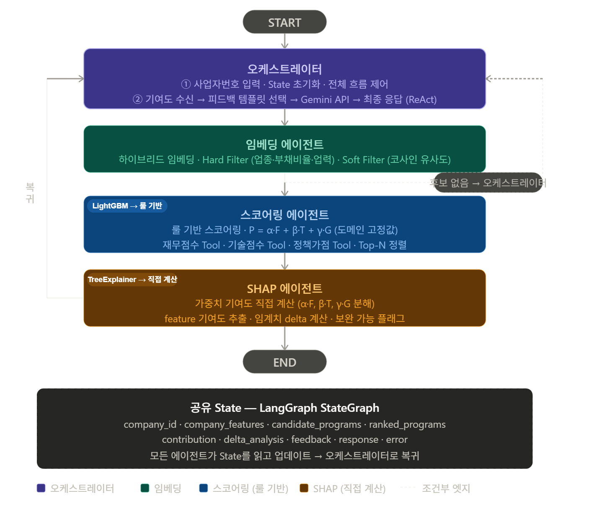
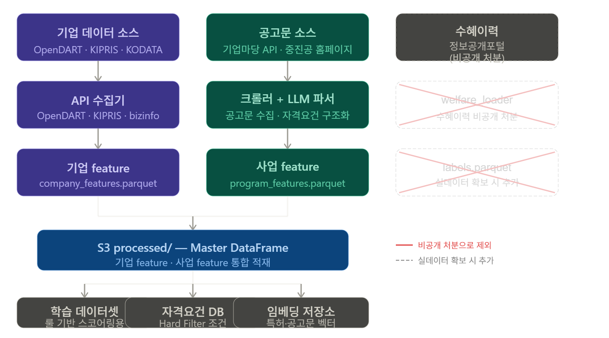

# 중진공 AI 자금 네비게이터


---

## 1. 프로젝트 개요

> 중소기업 정책자금 AI 매칭 서비스 — 사업자번호 입력만으로 적합한 중진공 정책자금을 자동 추천하고 XAI 기반 개선 가이드를 제공합니다.

### 배경

중소기업이 정책자금을 신청하려면 수십 개의 사업 공고를 직접 확인하고 자격 요건을 일일이 대조해야 한다. 이 과정에서 정보 비대칭으로 인해 자격이 되는 기업도 신청을 포기하거나 부적격 사업에 헛걸음하는 문제가 발생한다.

### 목표

- **사업자번호 입력 → 정책자금 Top-N 자동 추천** (Hard/Soft Filter + 룰 기반 스코어링)
- **스코어링 수식**: `P = α·F + β·T + γ·G` (재무 0.4 · 기술 0.3 · 정책가점 0.3)
- **XAI 기반 매칭 이유 및 개선 가이드** 제공 (feature별 가중치 기여도 직접 계산)

> AI, 공공데이터 활용 및 창업 경진대회 공모전 출품작

---

## 2. 서비스 아키텍처

### ① 데이터 파이프라인

```
[OpenDART API]──┐
[KIPRIS API]────┼──(Airflow DAG: 병렬 extract)──► S3 raw/
[중소벤처24 API]─┘                                     │
[중진공 홈페이지]────(crawler.py)──────────────────────┘
                                                       │
                                   ┌───────────────────┤
                                   │  processor.py      │
                                   │  (Gemini API LLM)  │
                                   └──────┬────────────┘
                                          │
                                 transformers/merge.py
                                          │
                                          ▼
                               S3 processed/
                         ├── company_features.parquet   # 기업 feature
                         └── program_features.parquet   # 사업 feature (자격요건 포함)
```

- Airflow 2.9 + CeleryExecutor + Docker Compose
- 스케줄: `@weekly` / 수동 트리거 가능
- 태스크 간 데이터 전달: S3 경로 (XCom 최소화)

### ② LangGraph MAS 에이전트 구조

```
FastAPI /match
     │
     ▼
오케스트레이터 (State 초기화 · 흐름 제어 · 최종 응답 조합)
     │
     ▼
임베딩 에이전트 (Hard Filter → Soft Filter → 후보 목록 생성)
     │  후보 없으면 조기 복귀 ↩
     ▼
스코어링 에이전트 (P = α·F + β·T + γ·G → Top-N 정렬)
     │
     ▼
SHAP 에이전트 (feature 기여도 계산 · delta 분석 · 보완 플래그)
     │
     ▼
오케스트레이터 (Gemini API → 자연어 피드백 생성 → 최종 응답)
```

#### 아키텍처 다이어그램



#### 데이터 파이프라인 다이어그램



---

## 3. 프로젝트 구조

```
policy-fund-navigator/
├── docker-compose.yaml          # 전체 스택 (Airflow + MLflow + backend + frontend)
├── .env.example                 # 환경변수 템플릿
│
├── backend/                     # FastAPI 서버 + ETL + MAS 에이전트
│   ├── Dockerfile
│   ├── requirements.txt
│   ├── api/
│   │   ├── main.py              # FastAPI 앱 (lifespan: PolicyVectorStore 초기화)
│   │   └── routers/
│   │       ├── match.py         # POST /api/v1/match
│   │       └── feedback.py      # GET  /api/v1/feedback/{program_id}
│   ├── agents/                  # LangGraph MAS 에이전트
│   │   ├── orchestrator/        # State 초기화·흐름 제어·피드백 생성
│   │   ├── embedding/           # Hard/Soft Filter (ChromaDB + KR-SBERT)
│   │   ├── scoring/             # 룰 기반 스코어링 (P = α·F + β·T + γ·G)
│   │   └── shap/                # feature 기여도·delta 분석
│   ├── src/
│   │   ├── embedder.py          # PolicyVectorStore (ChromaDB 래퍼)
│   │   └── processor.py         # Gemini API LLM 파서 (공고문 → 자격요건 JSON)
│   ├── dags/
│   │   ├── etl_pipeline.py      # 메인 Airflow DAG (@weekly)
│   │   ├── extractors/
│   │   │   ├── dart_extractor.py
│   │   │   ├── kipris_extractor.py
│   │   │   ├── bizinfo_extractor.py
│   │   │   ├── welfare_loader.py
│   │   │   └── crawler.py
│   │   └── transformers/
│   │       └── merge.py
│   ├── models/
│   │   ├── train.py
│   │   ├── predict.py
│   │   └── explainer.py
│   └── tests/
│       └── test_*.py
│
├── frontend/                    # Next.js 챗봇 UI
│   ├── Dockerfile
│   └── src/app/
│       ├── page.tsx             # 메인 채팅 UI
│       └── components/          # ChatWindow, UserMessage, BotMessage
│
└── PRD/
    └── PRD.md                   # 제품 요구사항 문서
```

---

## 4. 시작하기

### Prerequisites

- Docker Desktop
- AWS 계정 및 S3 버킷
- 아래 API 키 발급 필요:

| API | 발급처 |
|---|---|
| OpenDART | https://opendart.fss.or.kr |
| KIPRIS | https://plus.kipris.or.kr |
| 기업마당 (bizinfo) | https://www.bizinfo.go.kr |
| Gemini API | https://aistudio.google.com |

### Docker Quick Start

**① 저장소 클론**

```bash
git clone https://github.com/Dongjin-1203/policy-fund-navigator
cd policy-fund-navigator
```

**② .env 설정**

```bash
cp .env.example .env
# .env 파일을 열고 API 키 및 AWS 자격증명 입력
```

**③ 전체 스택 실행**

```bash
docker compose up -d
```

| 서비스 | URL |
|---|---|
| 챗봇 UI (Next.js) | http://localhost:3000 |
| API 서버 (FastAPI) | http://localhost:8000/docs |
| Airflow UI | http://localhost:8080 (admin/admin) |
| MLflow UI | http://localhost:5000 |

> 초기 기동 시 `airflow-init` → `airflow-webserver` 순으로 약 2~3분 소요

### 로컬 개발 (Docker 없이)

```bash
# 백엔드
cd backend
pip install -r requirements.txt
uvicorn api.main:app --reload --port 8000

# 프론트엔드
cd frontend
npm install
npm run dev
```

---

## 5. 실행 방법

### ETL 파이프라인 (Airflow)

```bash
# Airflow UI에서 etl_pipeline DAG 트리거 (권장)
# 또는 개별 모듈 직접 실행:

cd backend

python dags/extractors/dart_extractor.py
python dags/extractors/kipris_extractor.py
python dags/extractors/bizinfo_extractor.py
python dags/extractors/crawler.py

python src/processor.py                   # Gemini API LLM 파싱
python dags/transformers/merge.py         # S3 processed/ 생성
```

### Mock 모드 (API 키 없이 구조 검증)

```bash
cd backend
python dags/extractors/kipris_extractor.py --mock
python dags/extractors/crawler.py --mock
python dags/transformers/merge.py --mock
```

### API 엔드포인트

| 메서드 | 경로 | 설명 |
|---|---|---|
| POST | `/api/v1/match` | 사업자번호 → Top-N 정책자금 추천 |
| GET | `/api/v1/feedback/{program_id}` | 특정 사업 XAI 피드백 조회 |

---

## 6. 테스트

```bash
cd backend

# 전체 테스트
pytest tests/

# 개별 모듈 스모크 테스트
python dags/extractors/dart_extractor.py
python dags/extractors/kipris_extractor.py --mock
python dags/extractors/crawler.py --mock
```

---

## 7. 현재 제약사항

> ⚠️ 아래 항목은 현재 제한이 있거나 구현 진행 중입니다.

| 항목 | 상태 | 비고 |
|---|---|---|
| 수혜이력 데이터 | ❌ 비공개 처분 | 룰 기반 스코어링(`P = α·F + β·T + γ·G`)으로 대체. 이의신청 병행 중 |
| DART 재무 데이터 | ⚠️ 비상장사 null | `company_features.parquet` 재무 필드 전체 null. F 점수 기본값 처리 예정 |
| KIPRIS extractor | ⚠️ mock 모드 | API 키 설정 시 자동으로 실전 전환. 실전 호출 검증 완료 |
| MAS 에이전트 | ✅ 구현 완료 | LangGraph 오케스트레이터·임베딩·스코어링·SHAP 에이전트 |
| FastAPI 서버 | ✅ 구현 완료 | `/api/v1/match`, `/api/v1/feedback/{program_id}` |
| 챗봇 UI | ✅ 구현 완료 | Next.js + Zustand 기반 대화형 인터페이스 |

---

## 8. 팀 구성

| 역할 | 담당자 | 담당 영역 |
|---|---|---|
| AI 엔지니어 · 데이터 엔지니어 | 지동진 | ETL 파이프라인, 크롤러, MAS 구현 (오케스트레이터·스코어링·SHAP), FastAPI 서버 |
| AI 엔지니어 | 박지윤 | LLM 파서, 임베딩 에이전트, 피드백 템플릿 DB, 프로젝트 제안서 작성 |

- 지동진: https://github.com/Dongjin-1203
- 박지윤: https://github.com/krapnuyij

---

## 9. 기술 스택


| 레이어 | 기술 |
|---|---|
| ETL 오케스트레이션 | Apache Airflow 2.9 + Docker Compose |
| 스토리지 | AWS S3 (날짜 파티셔닝: `raw/{source}/YYYY-MM-DD/`) |
| 데이터 처리 | pandas, pyarrow |
| LLM 파싱 | LangChain LCEL + Gemini 2.5-flash |
| MAS 프레임워크 | LangGraph |
| 스코어링 | 룰 기반 (`P = α·F + β·T + γ·G`) → 실데이터 확보 시 LightGBM 전환 예정 |
| XAI | 가중치 기여도 직접 계산 → 실데이터 확보 시 SHAP 전환 예정 |
| 실험 관리 | MLflow (파라미터 버전 관리) |
| API 서버 | FastAPI |
| 크롤링 | requests.Session + BeautifulSoup4 (JS SPA AJAX 직접 호출) |
| HWP 파싱 | pdfplumber, olefile |

---

## License

Apache License 2.0
